# 3D Printing Laboratory — Topology-Optimized PLA Bridge

**Course:** 3D Printing Laboratory (iLAS) — Technische Universität Hamburg  
**Semester:** WS 2024/25  
**Team:** Group 7 (6 members)  
**My Role:** Product Design — Initial CAD (Fusion 360) + Topology Optimization & Simulation (SolidWorks)  
**Tools:** Fusion 360 · SolidWorks · PrusaSlicer · Prusa Mini+  
**Material:** PLA — Standard FFF/MEX Settings  

---

## Project Brief

Design, manufacture, and structurally test a **3-point-loaded bridge structure** using Material Extrusion (MEX/FFF) 3D printing. The bridge must be assembled from printed parts only — no glue, no screws — using a **printed mechanical joint**, and must withstand a minimum load of 100 N.

### Design Specifications

| Parameter | Requirement |
|---|---|
| Bearing distance | 300 mm |
| Maximum height | ≤ 70 mm |
| Maximum width | ≤ 35 mm |
| Minimum gap (width × height) | ≥ 60 mm × 40 mm |
| Minimum load resistance | ≥ 100 N |
| Maximum failure load | ≤ 500 N |
| Parts | 2–3 printed pieces |
| Connection | Printed mechanical joint only — no adhesive or fasteners |

**Bonus:** Best Strength-to-Weight ratio wins a special prize.

---

## Full Project Workflow

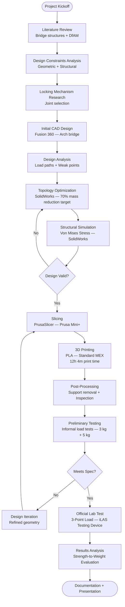

---

## Team & Roles

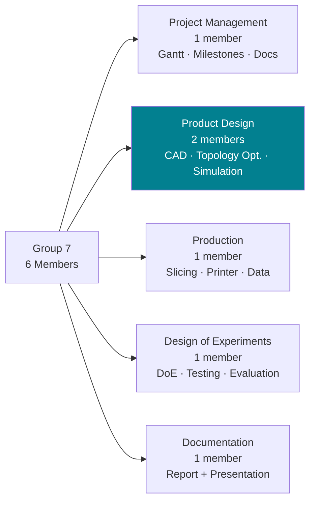

> I was part of the **Product Design** sub-team — responsible for the initial CAD model in Fusion 360 and all topology optimization and FEA simulation work in SolidWorks.

---

## Locking Mechanism — Koshikake Aritsugi

The lab prohibited any adhesive or mechanical fastener. The only permitted connection was a **printed mechanical joint**. After researching joinery techniques, we selected the **Koshikake Aritsugi** — a stepped dovetailed splice joint from classical Japanese timber architecture. This joint interlocks in both bending and shear, making it structurally ideal for a midspan connection under 3-point loading.

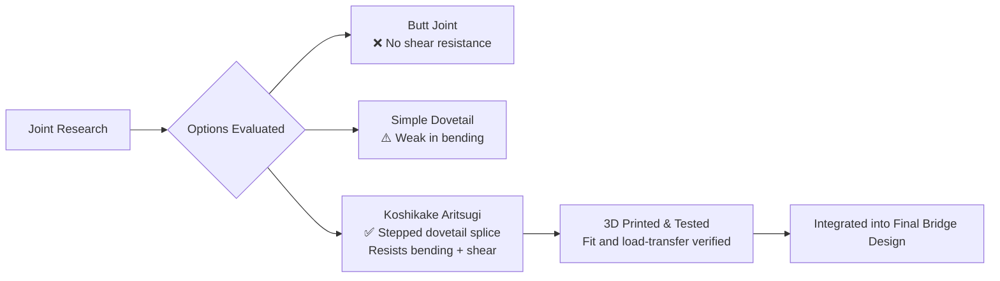

| | |
|---|---|
| 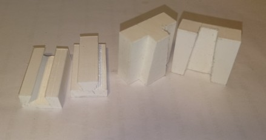 | 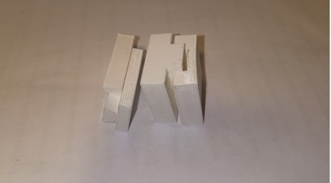 |
| *Joint halves disassembled — stepped dovetail profile visible* | *Joint halves assembled — interlocked without adhesive* |

> **Reference:** Wood Joints in Classical Japanese Architecture — https://fabiap.files.wordpress.com/2011/01/wood-joints-in-classical-japanese-architecture.pdf

---

## Design Phase 1 — Initial CAD (Fusion 360)

The first design was an arch bridge based on structural first principles. An arch efficiently converts midspan load into compressive forces along its axis — well suited to 3-point bending. Bearing ends were hollowed to reduce mass while maintaining contact area with the test fixture. The Koshikake Aritsugi joint was integrated at midspan, splitting the bridge into two symmetrical halves.

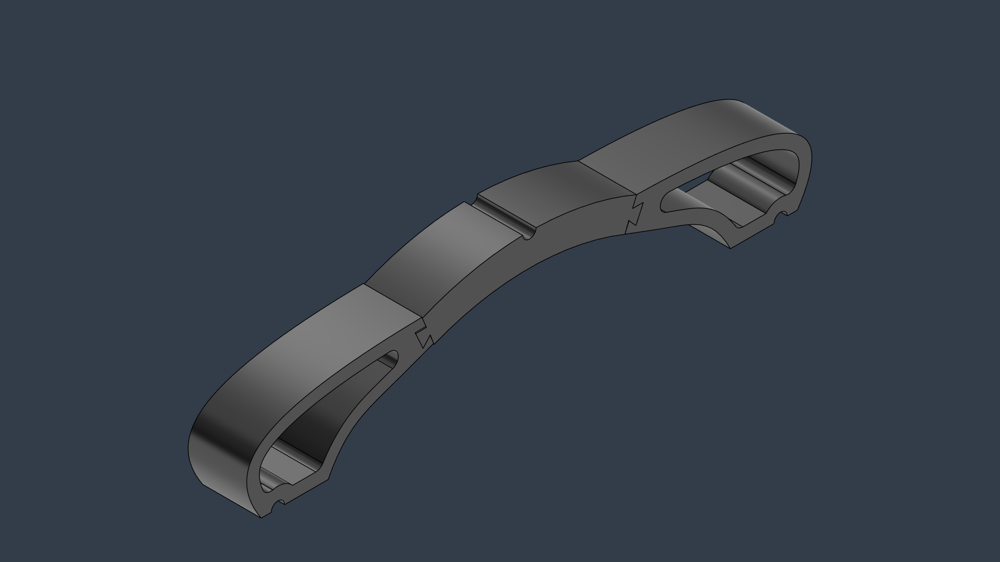
*Initial arch bridge design (Fusion 360) — organic hollowed arch form with integrated dovetail splice joint at midspan*

---

## Design Phase 2 — Topology Optimization (SolidWorks)

The initial design was imported into SolidWorks for a formal topology optimization study. The goal was to identify and remove non-load-bearing material while preserving structural integrity under the 3-point load condition.

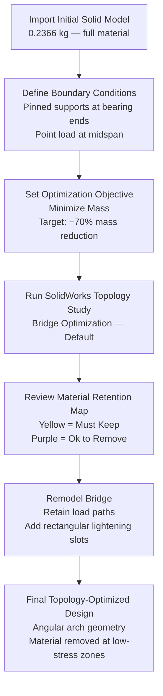

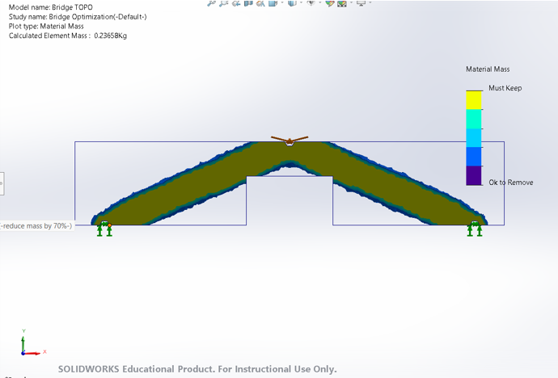
*SolidWorks topology study — yellow regions are primary load paths (must retain), purple regions flagged for removal. Initial element mass: 0.2366 kg. Target: −70%.*

---

## Design Phase 3 — Structural Simulation (SolidWorks)

Following topology optimization, a static Von Mises stress analysis was run on the optimized assembly to verify stress levels remained within acceptable limits under the expected 500 N load.

**Key findings:**
- Maximum stress concentrated at the midspan load application point and bearing contacts — expected for 3-point bending
- The arch body remained in a low-stress regime throughout
- No unexpected failure zones introduced by the material removal

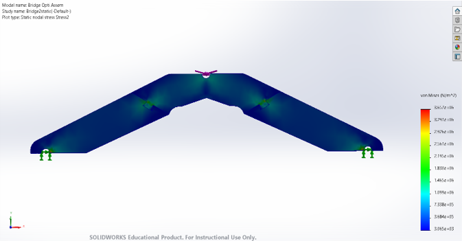
*SolidWorks static analysis — Von Mises stress distribution under 3-point load. Stress peak at midspan and bearing contact points. Arch body shows low stress throughout.*

---

## Final Design

The topology-optimized model was finalized for printing. Key features of the final design:

- Angular arch geometry derived from topology optimization result
- Two rectangular lightening slots per half (material removed at low-stress zones)
- Koshikake Aritsugi joint retained and refined at midspan
- Flat bearing pads at each end for clean contact with test fixture

| | |
|---|---|
| 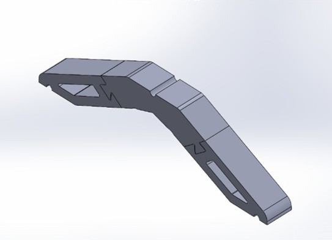 |  |
| *Final bridge half — SolidWorks render. Lightening slots and dovetail joint visible.* | *Final printed and assembled bridge — two halves connected via Koshikake Aritsugi joint* |

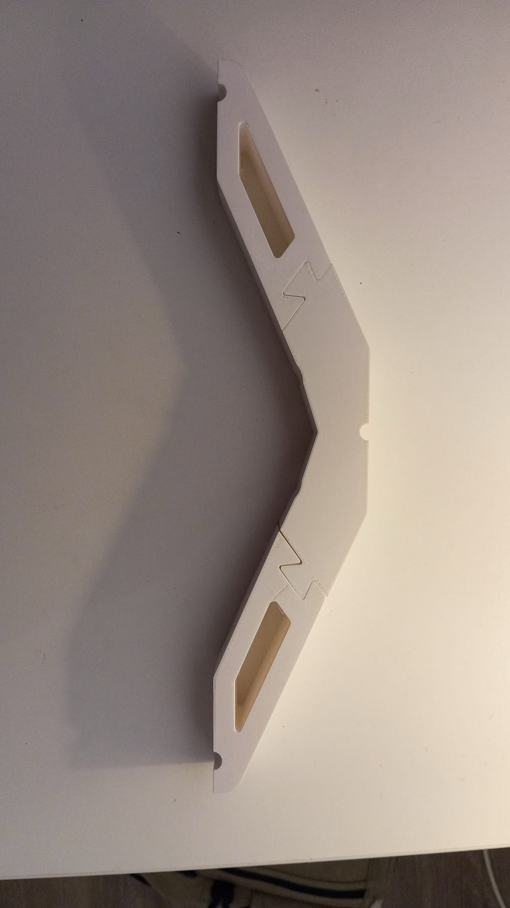
*Side view of one bridge half — rectangular lightening slots and zigzag dovetail joint profile clearly visible in the printed PLA part*

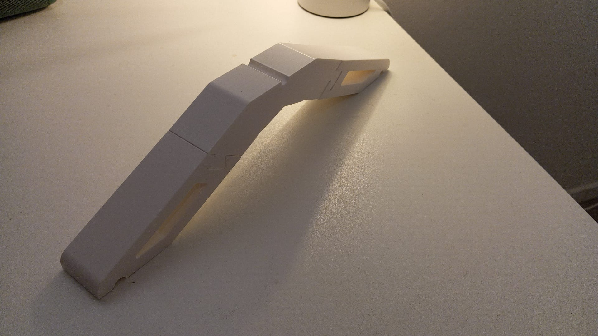
*3/4 view — topology-optimized arch form with printed Koshikake Aritsugi joint at the splice point*

---

## 3D Printing Process

### Print Workflow

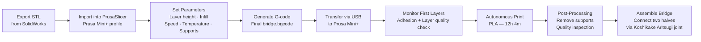

### Print Specifications

| Parameter | Value |
|---|---|
| Printer | Original Prusa Mini+ |
| Material | PLA |
| Nozzle | 0.4 mm |
| Max nozzle temperature | 240 °C |
| Slicer | PrusaSlicer |
| Print time | 12 hours 4 minutes |
| Final bridge mass | 172.6 g |

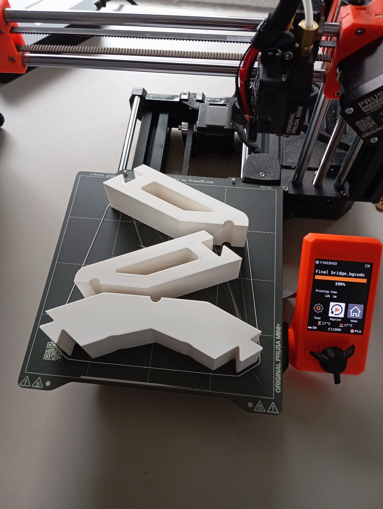
*Both bridge halves on the Prusa Mini+ build plate immediately after print completion — printer screen confirms: "Final bridge.bgcode — 100% — Printing time: 12h 4m"*

### Assembly

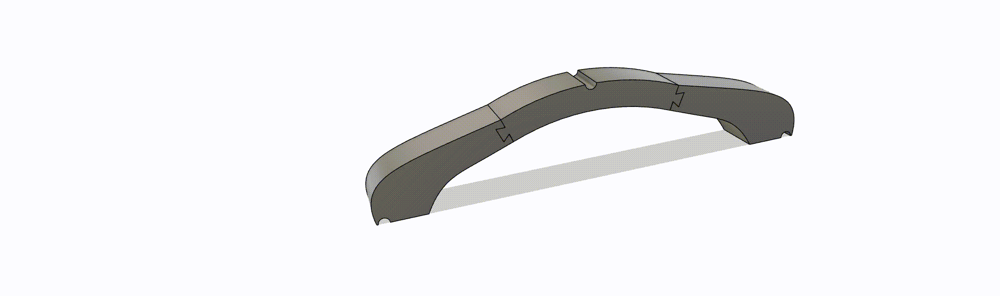
*Assembly of the two bridge halves via the Koshikake Aritsugi dovetailed splice joint — no tools, glue, or fasteners required*

---

## Testing

### Preliminary Testing

Before the official lab test, the team performed informal load tests using dead weights to validate the design and identify any weak points.

| | |
|---|---|
| 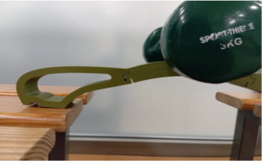 | 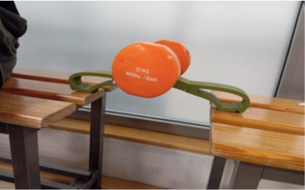 |
| *Preliminary test — 3 kg load (~29 N). Bridge holds without visible deformation.* | *Preliminary test — 5 kg load (~49 N). No visible deformation. Design validated for higher loading.* |

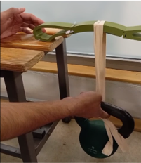
*Bridge after preliminary failure testing — fracture propagated at midspan under increasing load*

### Official Lab Test — 3-Point Loading (iLAS Testing Device)

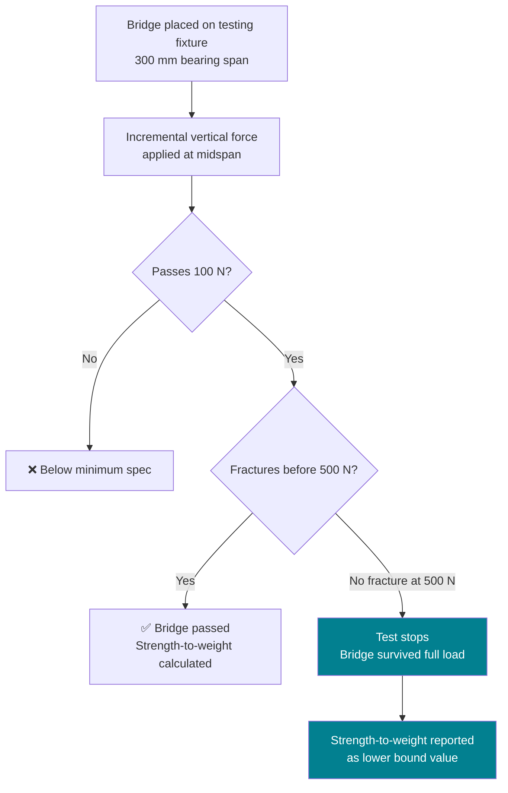

### Official Results — Group 7

| Metric | Result |
|---|---|
| Bridge mass | 172.6 g |
| Maximum test load | > 500 N |
| Passed 100 N threshold | ✅ Yes |
| Fractured before 500 N | No — survived full test |
| Strength-to-Weight ratio | > 2.90 N/g |

The bridge withstood the full 500 N test load without fracture. The strength-to-weight ratio of > 2.90 N/g is a lower bound — the actual structural capacity exceeds this figure since the bridge never reached its failure point.


*Official iLAS 3D Printing Lab results — Group 7: 172.6 g, >500 N, strength-to-weight ratio >2.90 N/g*

---

## Design of Experiments (DoE)

To determine optimal print settings before committing to the final bridge print, key parameters were systematically varied and evaluated.

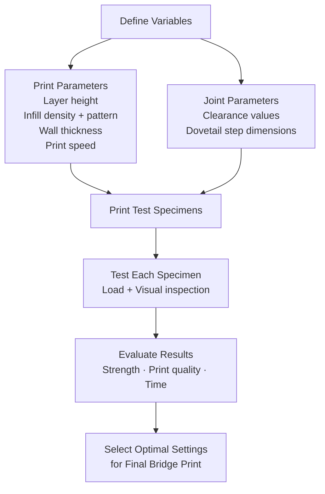

Parameters varied during DoE included layer height, infill density, infill pattern, wall thickness, and print speed. Findings informed the final print configuration to balance structural performance with material efficiency.

---

## Cost Estimation

A full time-cost breakdown was performed as part of the project documentation.

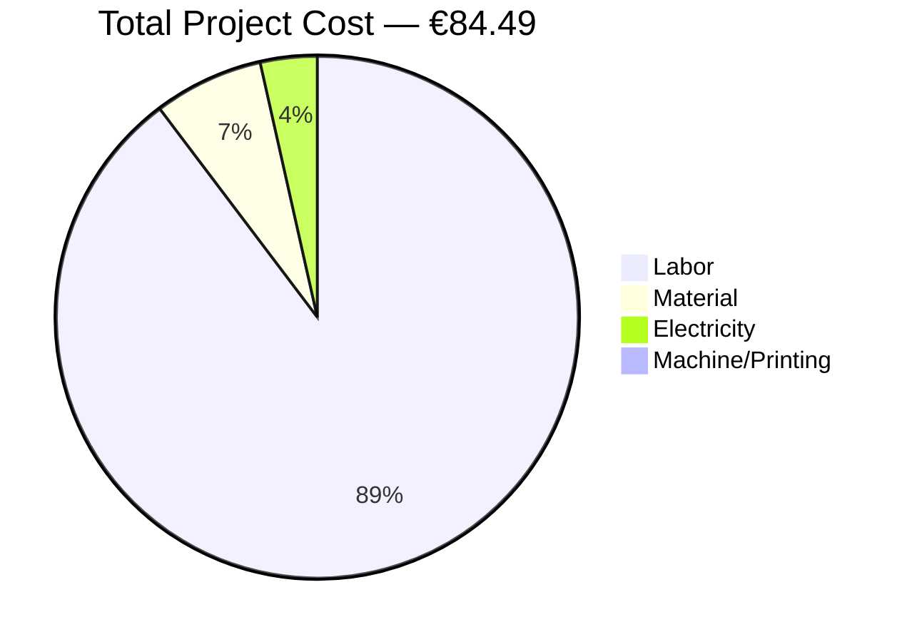

| Cost Component | Calculation | Amount |
|---|---|---|
| Material | 0.191 kg × €29.99/kg (PLA filament) | €5.72 |
| Labor | 3 project hours × €25.20/hr (avg. wage) | €75.60 |
| Printing | 12.10 machine hours × €0.01746/hr | €0.21 |
| Electricity | 650 W × 12 h ÷ 1000 × €0.38/kWh = 7.8 kWh | €2.96 |
| **Total** | | **€84.49** |

> Labor cost dominates the total — a realistic reflection of the engineering time invested in research, CAD, optimization, simulation, and testing, as opposed to raw material and machine costs which are comparatively minimal in desktop FFF/MEX manufacturing.

---

## Key Takeaways

- Practical application of **Design for Additive Manufacturing (DfAM)** — designing for printability while maintaining structural performance
- Hands-on experience with **topology optimization** to minimize material without compromising load paths
- Research and integration of a **historically-inspired mechanical joint** (Koshikake Aritsugi) as the sole assembly method between printed parts
- Full **MEX process chain**: CAD → topology study → FEA simulation → slicing → printing → post-processing → testing
- Understanding of **trade-offs between mass, strength, and printability** in desktop FFF manufacturing
- **Agile project management** across a 6-person interdisciplinary team with defined sub-roles and milestones

---

## Repository Structure

```
├── README.md
├── images/
│   ├── initial_design_cad.png            # Fusion 360 render — initial arch design
│   ├── topology_optimization.png         # SolidWorks topology study result
│   ├── stress_simulation.png             # Von Mises stress analysis
│   ├── final_design_cad.png              # SolidWorks render — topology-optimized half
│   ├── final_assembled_bridge.jpg        # Photo of assembled final bridge
│   ├── final_print_side.jpg              # Side view — joint and slots detail
│   ├── final_print_half.jpg              # 3/4 view of one bridge half
│   ├── final_print_prusa.jpg             # Fresh off Prusa Mini+ build plate
│   ├── dovetail_joint_disassembled.jpg   # Koshikake Aritsugi joint — open
│   ├── dovetail_joint_assembled.jpg      # Koshikake Aritsugi joint — locked
│   ├── test_3kg.jpg                      # Preliminary test — 3 kg load
│   ├── test_5kg.jpg                      # Preliminary test — 5 kg load
│   ├── bridge_failure.jpg                # Bridge after failure testing
│   ├── results_table.jpg                 # Official iLAS class results
│   └── assembly.gif                      # Assembly of two halves via joint
└── bridge_assembly.step                  # STEP file — full bridge assembly
```

---

## Tools Used

| Tool | Purpose |
|---|---|
| Autodesk Fusion 360 | Initial 3D CAD design |
| SolidWorks (Educational) | Topology optimization + Static FEA simulation |
| PrusaSlicer | Slicing + G-code generation |
| Original Prusa Mini+ | FFF/MEX printing — PLA |

---

## Disclaimer

This project was completed as part of the **3D Printing Laboratory** course at the **Institut für Laser- und Anlagensystemtechnik (iLAS)**, Technische Universität Hamburg-Harburg (WS 2024/25). All parts were printed at the iLAS facility using university equipment and materials. This is a student academic project and has not been validated for any real-world structural application.
